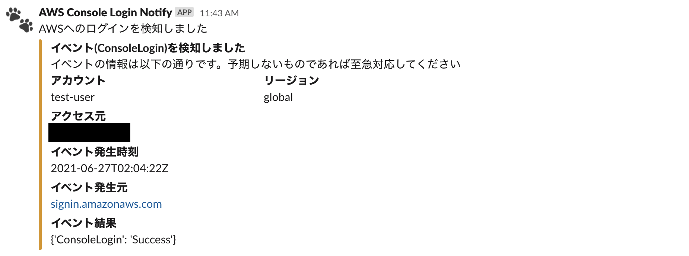

# AWS Console Login Notifier
AWSへのコンソールログインをSlack通知するスクリプト

## 使用方法
 0. SlackのIncoming webhook用のURLを発行
 1. 本リポジトリの内容をLambdaへデプロイ、環境変数(`SLACK_WEBHOOK_URL`)に0で用意したURLを設定
 2. SNSでTopicで任意のトピックを作成し、サブスクリプションに1でデプロイしたLambdaを登録
 3. CloudWatch Eventsのルールにて、イベントソースのサービス名を「AWSコンソールのサインイン」を選択、ターゲットに2で作成したSNSトピックを指定

## Todo
 - [ ] Severlessframework対応